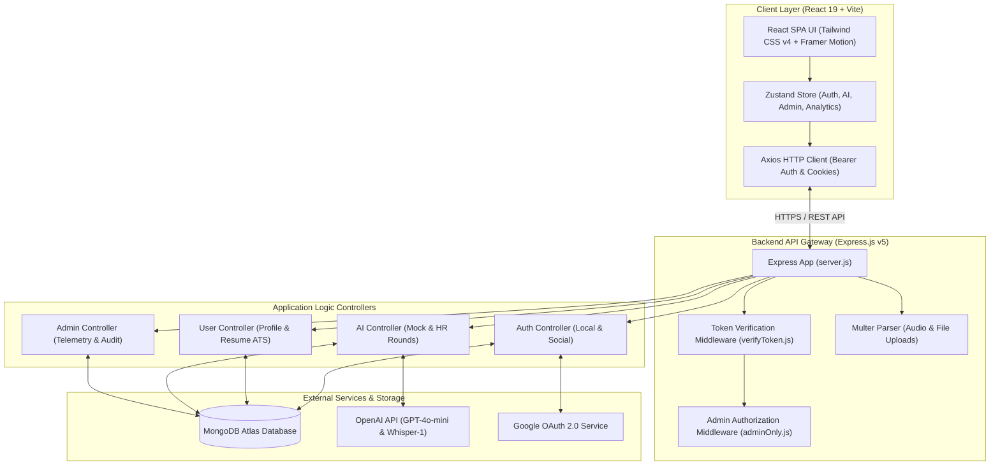
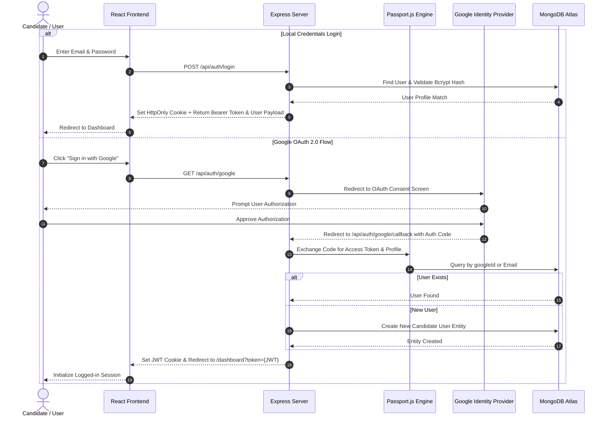
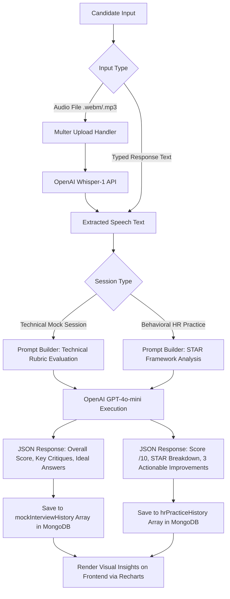
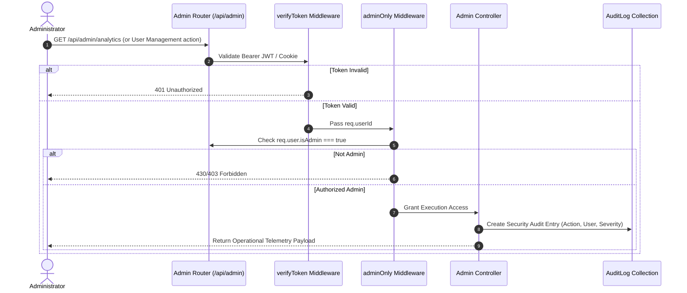

# 🤖 AI Interview Preparation Platform (PrepAI)

[](https://ai-interview-prep-frontend-kappa.vercel.app)
[](https://ai-interview-prep-backend-eta.vercel.app)
[](LICENSE)
[](https://nodejs.org/)
[](https://react.dev/)
[](https://www.mongodb.com/)
[](https://openai.com/)

---

## 📖 Table of Contents
1. [Executive Summary & Platform Purpose](#-executive-summary--platform-purpose)
2. [System Architecture & Diagrams](#-system-architecture--diagrams)
   - [1. High-Level System Architecture](#1-high-level-system-architecture)
   - [2. User Authentication & OAuth 2.0 Flow](#2-user-authentication--oauth-20-flow)
   - [3. AI Core Processing & Feedback Loop](#3-ai-core-processing--feedback-loop)
   - [4. Database Schema Entity-Relationship Diagram](#4-database-schema-entity-relationship-diagram)
   - [5. Admin Security & Telemetry Workflow](#5-admin-security--telemetry-workflow)
3. [Core Feature Breakdown](#-core-feature-breakdown)
   - [👤 Candidate Capabilities](#-candidate-capabilities)
   - [🛡️ Administrative & Observability Suite](#️-administrative--observability-suite)
4. [Technology Stack](#-technology-stack)
5. [Repository Directory Structure](#-repository-directory-structure)
6. [Complete API Endpoint Reference](#-complete-api-endpoint-reference)
   - [Authentication Routes (`/api/auth`)](#1-authentication-routes-apiauth)
   - [User & Dashboard Routes (`/api/user`)](#2-user--dashboard-routes-apiuser)
   - [AI & Practice Routes (`/api/ai`)](#3-ai--practice-routes-apiai)
   - [Admin Portal Routes (`/api/admin`)](#4-admin-portal-routes-apiadmin)
7. [Environment Variables Configuration](#-environment-variables-configuration)
8. [Local Installation & Setup Guide](#-local-installation--setup-guide)
9. [Database Seeding & Admin Setup](#-database-seeding--admin-setup)
10. [Production Deployment Strategy](#-production-deployment-strategy)
11. [Security & Compliance Architecture](#-security--compliance-architecture)

---

## 🎯 Executive Summary & Platform Purpose

The **AI Interview Preparation Platform (PrepAI)** is an end-to-end, enterprise-grade application designed to empower software professionals, candidates, and job seekers through artificial intelligence. By combining automated technical screening, behavioral interview coaching, dynamic resume parsing, and voice-to-text response processing, PrepAI transforms traditional job preparation into an intelligent, data-driven experience.

### 🌟 Key Objectives
- **Role-Targeted Simulation**: Deliver realistic technical and behavioral interview sessions tailored by domain (MERN, Frontend, Backend, Machine Learning, Data Analytics, UI/UX) and difficulty level (Junior, Mid, Senior, Lead).
- **STAR Method Coaching**: Evaluate candidate responses against the **Situation, Task, Action, Result** framework with granular feedback, audio transcription, and improvement suggestions.
- **ATS Resume Parsing**: Parse uploaded PDF resumes using string-matching, action-verb density calculation, metric detection algorithms, and market-standard keyword alignment.
- **Enterprise Governance**: Provide system administrators with a control room featuring active user management, session telemetry, audit logging, and LLM usage analytics.

---

## 📐 System Architecture & Diagrams

### 1. High-Level System Architecture
The application follows a decoupled client-server architecture. The frontend is built as a single-page application (SPA) using React 19, Vite, and Zustand for state management. The backend is an Express.js application powered by Node.js, integrating MongoDB Atlas for persistence and OpenAI APIs for intelligence.



---

### 2. User Authentication & OAuth 2.0 Flow
The platform supports dual-mode authentication: local credentials (password-hashed via bcryptjs with JWT issuing) and Google OAuth 2.0 facilitated by Passport.js.



---

### 3. AI Core Processing & Feedback Loop
Technical mock sessions and behavioral HR practice leverage OpenAI `gpt-4o-mini` for response evaluation and `whisper-1` for audio transcription.



---

### 4. Database Schema Entity-Relationship Diagram
The persistence layer relies on two primary Mongoose schemas: `User` (which embeds sub-documents for saved questions, mock histories, and resume metrics) and `AuditLog`.

```mermaid
erDiagram
    USER ||--o{ SAVED_QUESTION : contains
    USER ||--o{ MOCK_INTERVIEW_SESSION : records
    USER ||--o{ HR_PRACTICE_SESSION : records
    USER ||--o1 RESUME_ANALYSIS : stores

    USER {
        ObjectId _id PK
        String name
        String email UK
        String password
        String googleId
        String avatar
        String role
        String experience
        Array skills
        Array targetCompanies
        String education
        Object resume
        Array questionFolders
        Boolean isAdmin
        String status
        Date createdAt
        Date updatedAt
    }

    RESUME_ANALYSIS {
        Number score
        Array strengths
        Array missingKeywords
        Array keywordOptimization
        Array checklist
        Object featuredImprovement
        Object detailedAnalysis
    }

    SAVED_QUESTION {
        ObjectId _id PK
        String text
        String category
        String difficulty
        String answer
        Boolean isFavorite
        String folder
        Date savedAt
    }

    MOCK_INTERVIEW_SESSION {
        ObjectId _id PK
        String role
        String difficulty
        Number score
        String feedback
        Array questions
        Date completedAt
    }

    HR_PRACTICE_SESSION {
        ObjectId _id PK
        String question
        String answer
        Number score
        String feedback
        Object starAnalysis
        Array improvements
        Date completedAt
    }

    AUDIT_LOG {
        ObjectId _id PK
        Date timestamp
        String user
        String action
        String type
        String severity
        String status
        String detail
        Object metadata
    }
```

---

### 5. Admin Security & Telemetry Workflow
All administrative operations pass through strict verification and auditing stages to ensure zero unauthorized access and full system traceability.



---

## 🚀 Core Feature Breakdown

### 👤 Candidate Capabilities

#### 1. 📊 Interactive Dashboard & Progress Telemetry
- **Overall Completion Score**: Real-time evaluation of user profile completeness, resume uploads, and practice activity.
- **Performance Analytics**: Recharts-driven visual trend mapping over 6-month preparation cycles.
- **Recent Activity Feed**: Quick navigation to recent mock screenings, behavioral practice rounds, and resume evaluation logs.

#### 2. 🎯 AI Technical Mock Interview Simulator
- **Dynamic Session Construction**: Select target job role, topic, and difficulty to generate tailored 3-question interview rounds.
- **Real-Time Guidance**: Instant access to subtle hints and ideal answer rubrics.
- **AI Answer Grading**: Automated grading engine assessing candidate answers, delivering total score out of 100, overall feedback summary, and per-question critiques.

#### 3. 🎙️ HR Behavioral Round & Voice Practice
- **Role-Specific Behavioral Questions**: AI-generated behavioral questions covering Leadership, Conflict Resolution, Adaptability, and Problem Solving.
- **Voice-to-Text Speech Processing**: Integration with OpenAI Whisper to record and transcribe audio answers directly in browser.
- **STAR Method Feedback**: Granular breakdown evaluating **Situation**, **Task**, **Action**, and **Result** components with actionable advice.
- **Behavioral Identity Summaries**: Automatic generation of high-level candidate insights updated every 5 practice rounds.

#### 4. 📑 ATS Resume Parser & Keyword Engine
- **PDF Extraction**: Native binary buffer extraction using `pdf-parse`.
- **Impact & Metric Scanning**: Algorithm detecting power action verbs (*spearheaded, architected, optimized*) and quantifiable metrics (*%, $, numbers*).
- **Role Benchmark Matching**: Cross-checks resume text against predefined industry skill benchmarks (MERN, Frontend, Backend, Machine Learning, Data Analyst, UI/UX).
- **Actionable Optimization Roadmap**: Highlights missing keywords, frequency gaps, checklist items, and step-by-step improvement guides.

#### 5. 💡 Dynamic Question Generator & Saved Vault
- **Instant Technical Question Generation**: Custom questions based on role, topic, and difficulty.
- **Deep Probing Follow-Ups**: AI-generated follow-up questions to test candidate depth.
- **Folder Management & Favorites**: Organize saved questions into custom folders, mark favorites, manually insert entries, and export sessions to CSV format.

---

### 🛡️ Administrative & Observability Suite

#### 1. 📈 System Telemetry & Admin Analytics
- **Live System Metrics**: Monitor active users, overall interview volumes, system accuracy rates, and question generations.
- **Domain & Complexity Distribution**: Interactive charts detailing domain demand (MERN, Python, ML, UI/UX) and difficulty selection ratios.
- **Session Retention Index**: Historical active user retention telemetry tracking monthly user engagement.
- **Cognitive Weak-Point Analysis**: Identifies lowest-scoring technical topics across all candidate interactions to inform platform content updates.

#### 2. 👥 User Management Hub & Provisioning
- **User Directory**: View candidate profiles, total completed interviews, average scores, and account status.
- **Direct User Provisioning**: Provision new accounts directly with specified roles and auto-generated secure credentials.
- **Account Controls**: Instant status updates (`Active` vs. `Suspended`) and safe user deletion guardrails.

#### 3. 📜 Security Audit Registry & Log Tracking
- **Categorized Event Logging**: Tracks `SYSTEM`, `SECURITY`, `AI_AGENT`, `API`, and `USER_ACTION` logs.
- **Severity Levels**: Filter logs by `Info`, `Warning`, or `Critical` severity.
- **Search & Filter Operations**: Query audit events by keyword, action name, or performing user ID.

---

## 🛠️ Technology Stack

| Layer | Technology | Key Dependencies & Version | Purpose |
| :--- | :--- | :--- | :--- |
| **Frontend Core** | React 19 + Vite | `react@19.2.4`, `vite@8.0.4` | High-performance single page application |
| **Styling & UI** | Tailwind CSS v4 + Framer Motion | `@tailwindcss/vite@4.2.2`, `framer-motion@12.38.0` | Modern, responsive interface with fluid micro-animations |
| **Icons & Fonts** | Lucide React | `lucide-react@1.8.0` | Comprehensive visual UI icon set |
| **State Management**| Zustand | `zustand@5.0.12` | Lightweight global store management |
| **Visual Charts** | Recharts | `recharts@3.8.1` | Analytics graphics and progress telemetry |
| **Data Export** | jsPDF & AutoTable | `jspdf@4.2.1`, `jspdf-autotable@5.0.7` | Client-side report generation |
| **Backend Core** | Node.js + Express.js | `express@4.21.2`, `nodemon` | RESTful API server architecture |
| **Database** | MongoDB Atlas + Mongoose | `mongoose@9.4.1` | NoSQL document storage and schema validation |
| **Authentication** | Passport.js + JWT | `passport@0.7.0`, `jsonwebtoken@9.0.3`, `bcryptjs@3.0.3` | OAuth 2.0 Google sign-in and JWT session security |
| **AI Integration** | OpenAI SDK | `openai@6.34.0` | Intelligence layer powered by `gpt-4o-mini` and `whisper-1` |
| **File Processing** | Multer & PDF-Parse | `multer@2.1.1`, `pdf-parse@1.1.1` | Audio buffer upload handling and ATS PDF parsing |

---

## 📂 Repository Directory Structure

```
AI-Interview-Preparation-Platform/
├── backend/
│   ├── config/
│   │   └── passport.js               # Passport Google OAuth strategy configuration
│   ├── controllers/
│   │   ├── adminController.js        # Admin analytics, user hub, and audit logging
│   │   ├── aiController.js           # Mock interview, STAR evaluation, Whisper transcription, folders
│   │   ├── authController.js         # Signup, login, logout, and token check routines
│   │   └── userController.js         # User profile, ATS resume scanner, dashboard data aggregator
│   ├── db/
│   │   └── connectDB.js              # MongoDB Mongoose connection utility
│   ├── middleware/
│   │   ├── adminOnly.js              # RBAC middleware restricting routes to admin users
│   │   └── verifyToken.js            # JWT verification middleware
│   ├── models/
│   │   ├── AuditLog.js               # Mongoose schema for system audit logs
│   │   └── User.js                   # Main Mongoose schema for users and embedded collections
│   ├── routes/
│   │   ├── adminRoutes.js            # Endpoints under /api/admin
│   │   ├── aiRoutes.js               # Endpoints under /api/ai
│   │   ├── authRoutes.js             # Endpoints under /api/auth
│   │   └── userRoutes.js             # Endpoints under /api/user
│   ├── uploads/                      # Temporary storage for audio processing
│   ├── seedAdmin.js                  # CLI script to seed default admin identity
│   ├── server.js                     # Main Express server entrypoint
│   ├── vercel.json                   # Serverless deployment configuration for Vercel
│   └── package.json
│
├── frontend/
│   ├── public/                       # Static public assets
│   ├── src/
│   │   ├── components/               # Reusable UI elements (Navbar, Sidebar, Layouts, Forms)
│   │   ├── lib/                      # Axios API client instance with interceptors
│   │   ├── pages/                    # Application screens (Dashboard, Mock, HR, Resume, Admin)
│   │   ├── store/                    # Zustand state management stores
│   │   ├── App.jsx                   # Route definition & layout wrapper
│   │   ├── main.jsx                  # Client React entrypoint
│   │   └── index.css                 # Global CSS variables & Tailwind directives
│   ├── vite.config.js                # Vite build and plugin settings
│   └── package.json
│
└── README.md                         # Comprehensive project documentation
```

---

## 📡 Complete API Endpoint Reference

### 1. Authentication Routes (`/api/auth`)
| Method | Endpoint | Auth Required | Description |
| :--- | :--- | :--- | :--- |
| `GET` | `/check-auth` | Yes (JWT) | Validates active session and returns user identity |
| `POST` | `/signup` | No | Registers a new user with email and password |
| `POST` | `/login` | No | Authenticates credentials, sets cookie, returns JWT |
| `POST` | `/logout` | No | Clears authentication cookies |
| `GET` | `/google` | No | Triggers Google OAuth 2.0 authorization redirect |
| `GET` | `/google/callback` | No | Handles Google OAuth callback and session creation |

---

### 2. User & Dashboard Routes (`/api/user`)
| Method | Endpoint | Auth Required | Description |
| :--- | :--- | :--- | :--- |
| `GET` | `/profile` | Yes | Retrieves profile details and completion score |
| `PUT` | `/profile` | Yes | Updates profile details and triggers ATS resume re-analysis |
| `GET` | `/analysis` | Yes | Returns latest ATS resume analysis details |
| `GET` | `/dashboard` | Yes | Returns aggregated dashboard data, stats, and charts |
| `PATCH` | `/analysis/checklist/:index` | Yes | Toggles completion state of resume checklist items |

---

### 3. AI & Practice Routes (`/api/ai`)
| Method | Endpoint | Auth Required | Description |
| :--- | :--- | :--- | :--- |
| `POST` | `/generate-questions` | Yes | Generates technical questions based on role, topic, and difficulty |
| `POST` | `/follow-up` | Yes | Generates a probing follow-up question |
| `POST` | `/sample-answer` | Yes | Generates an expert sample answer for a given question |
| `POST` | `/toggle-save` | Yes | Saves or removes a question from the user's saved bank |
| `GET` | `/saved` | Yes | Retrieves all saved questions |
| `PATCH` | `/favorite/:id` | Yes | Toggles favorite flag on a saved question |
| `DELETE` | `/saved/:id` | Yes | Removes a saved question |
| `POST` | `/export` | Yes | Exports provided question set to downloadable CSV |
| `GET` | `/hr/questions` | Yes | Generates behavioral HR questions tailored to target role |
| `POST` | `/hr/evaluate` | Yes | Evaluates an HR answer using the STAR framework |
| `POST` | `/transcribe` | Yes | Transcribes uploaded audio answer via OpenAI Whisper API |
| `GET` | `/hr/stats` | Yes | Fetches user HR behavioral practice statistics |
| `POST` | `/hr/update-insights` | Yes | Forces recalculation of user behavioral identity insights |
| `GET` | `/mock/generate` | Yes | Generates a full 3-question technical mock interview session |
| `POST` | `/mock/submit` | Yes | Submits and grades a completed technical mock interview session |
| `GET` | `/history` | Yes | Retrieves combined historical timeline for technical & HR sessions |
| `GET` | `/folders` | Yes | Lists all custom question folders |
| `POST` | `/folders` | Yes | Creates a new question folder |
| `DELETE` | `/folders/:name` | Yes | Deletes a folder and migrates questions to General |
| `PATCH` | `/saved/:id/folder` | Yes | Moves a saved question to a specified folder |
| `POST` | `/saved/manual` | Yes | Manually creates and saves a question entry |

---

### 4. Admin Portal Routes (`/api/admin`)
> *Note: All endpoints under `/api/admin` require both `verifyToken` and `adminOnly` middleware.*

| Method | Endpoint | Description |
| :--- | :--- | :--- |
| `GET` | `/users` | Retrieves all registered user accounts with activity summaries |
| `GET` | `/stats` | Fetches core system counts, growth trends, and domain analytics |
| `GET` | `/analytics` | Fetches deep system analytics, retention rates, and cognitive weak points |
| `GET` | `/logs` | Returns filtered system security audit logs |
| `GET` | `/logs/stats` | Fetches critical error and warning counters |
| `POST` | `/provision` | Manually provisions a new candidate or admin user account |
| `PUT` | `/users/:userId/status` | Updates user status between `Active` and `Suspended` |
| `DELETE` | `/users/:userId` | Permanently purges a user entity from the system |

---

## ⚙️ Environment Variables Configuration

Create a `.env` file in the **`backend/`** directory containing the following keys:

```env
# Server Runtime
PORT=5000
NODE_ENV=development

# Database Connection
MONGO_URI=mongodb+srv://<username>:<password>@cluster.mongodb.net/prep_ai_db?retryWrites=true&w=majority

# JWT Security
JWT_SECRET=your_super_secret_jwt_key_here_min_32_chars

# OAuth Credentials (Google Cloud Console)
GOOGLE_CLIENT_ID=your_google_oauth_client_id.apps.googleusercontent.com
GOOGLE_CLIENT_SECRET=your_google_oauth_client_secret

# AI Model Provider API Keys
OPENAI_API_KEY=sk-proj-your_openai_api_key_here

# Client URL (For CORS & OAuth Callbacks)
CLIENT_URL=http://localhost:5173
```

For the **`frontend/`** directory, create `.env.local` if custom API locations are required:
```env
VITE_API_URL=http://localhost:5000/api
```

---

## 💻 Local Installation & Setup Guide

### Prerequisites
- **Node.js**: `v18.0.0` or higher installed
- **npm**: `v9.0.0` or higher installed
- **MongoDB**: A running local MongoDB instance or a free [MongoDB Atlas Cluster](https://www.mongodb.com/cloud/atlas) URI
- **OpenAI API Key**: An active OpenAI API key with access to `gpt-4o-mini` and `whisper-1`

### Step 1: Clone the Repository
```bash
git clone https://github.com/sheetanshumohan/AI-Interview-Preparation-Platform.git
cd AI-Interview-Preparation-Platform
```

### Step 2: Set Up Backend Environment
```bash
# Navigate to backend directory
cd backend

# Install dependencies
npm install

# Create .env file and populate environment variables
cp .env.example .env   # Or create .env manually

# Launch backend in development mode
npm run dev
```
*The backend API server will start listening at `http://localhost:5000`.*

### Step 3: Set Up Frontend Application
```bash
# Open a new terminal and navigate to frontend directory
cd ../frontend

# Install dependencies
npm install

# Launch frontend application
npm run dev
```
*The Vite development server will start at `http://localhost:5173`.*

---

## 🔑 Database Seeding & Admin Setup

To seed a default administrator user account into the database, run the `seedAdmin.js` script located in the `backend/` directory:

```bash
cd backend
node seedAdmin.js
```

This populates the database with an initial administrator account:
- **Default Email**: `admin@prepai.com`
- **Default Password**: `Admin@PrepAI2026`
- **Permissions**: `isAdmin: true`

Log in using these credentials at `http://localhost:5173/login` to access the Administrative Portal (`/admin`).

---

## 🌐 Production Deployment Strategy

### 1. Backend Deployment (Vercel Serverless / Node Container)
The backend is structured to execute seamlessly on serverless platforms such as Vercel or container hosts like Render/Railway.

A root/backend `vercel.json` routes incoming API traffic:
```json
{
  "version": 2,
  "builds": [
    {
      "src": "server.js",
      "use": "@vercel/node"
    }
  ],
  "routes": [
    {
      "src": "/(.*)",
      "dest": "server.js"
    }
  ]
}
```

### 2. Frontend Deployment (Vercel SPA)
- Connect the GitHub repository to Vercel.
- Set Root Directory to `frontend`.
- Build Command: `npm run build`
- Output Directory: `dist`
- Configure Environment Variables in Vercel Dashboard:
  - `VITE_API_URL`: `https://ai-interview-prep-backend-eta.vercel.app/api`

---

## 🔒 Security & Compliance Architecture

1. **Authentication Guardrails**: Passwords hashed using `bcryptjs` with salt rounds set to 10. Sessions tracked via short-lived JWTs issued in secure, HTTP-only cookies (`sameSite: 'strict'`).
2. **Role-Based Access Control (RBAC)**: All administrative endpoints are guarded by `adminOnly` middleware verifying `isAdmin` claims in the database.
3. **Audit Logging**: Operational events, user status changes, entity purges, and security events are logged into the `AuditLog` collection for full transparency.
4. **Input Sanitization**: Request bodies processed with size limits (`5mb`), and file uploads strictly validated for supported audio/PDF MIME types.

---

<p center="true">
  <b>Built with passion for empowering candidate careers worldwide. 🚀</b>
</p>
